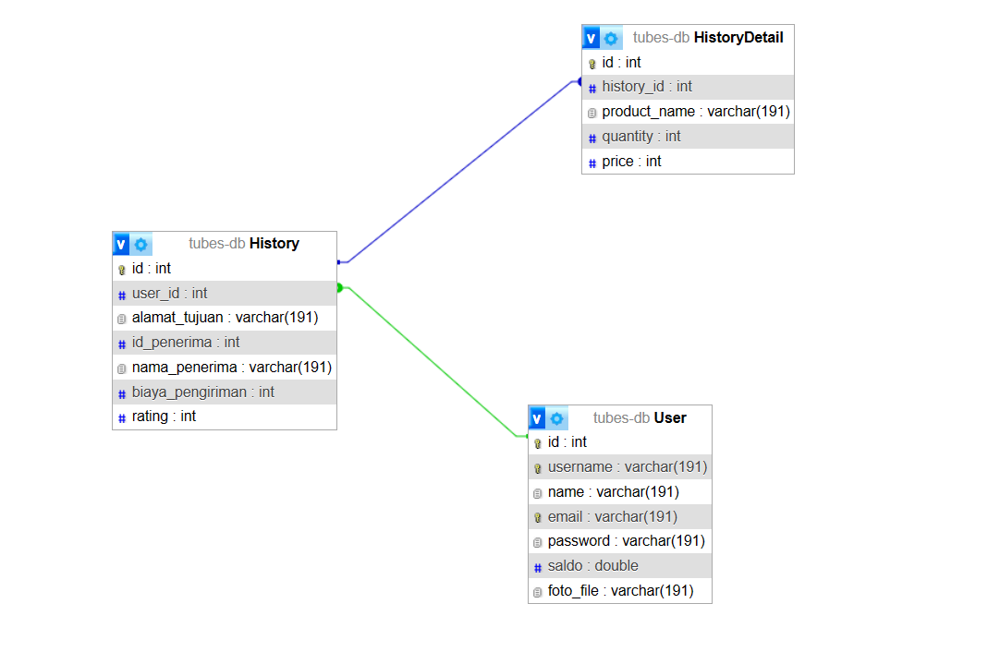

# Tugas Besar _Milestone 2_ IF3110 - _REST Service_

## Deskripsi _Web Service_
WebService ini adalah sebuah sevice rest yang berfungsi untuk mengatur mengatur kurir kurir yang ada di aplikasi kurir

## Skema Basis Data

   
## _Endpoint API_
### Endpoint untuk USER
post user/check-username 

post user/check-email

post user/register

post user/login

get user/balance/:username

post user/balance

get user/user-detail/:username

put user/user-detail/:username

get user/user-details/id/:id

### Endpoint untuk History
get history/ 

get history/detail/:id

get history/history/:id

get history/penerima/:id

put history/rating/:id

### Endpoint untuk order
get order/available-order

get order/order/:id

put order/order/:id

get order/order-details/:id

get order/order-courier/:id

put order/pick-order

## Pembagian Tugas

### Anggota Kelompok
**Kelompok 36**
| Nama                         | NIM      |
|------------------------------|----------|
| Ulung Adi Putra              | 13521122 |
| Naufal Baldemar Ardanni      | 13521154 |
| Dewana Gustavus Haraka Otang | 13521173 |

### REST

| Fungsionalitas                |           NIM                 |
|-------------------------------|-------------------------------|
| Setup             | 13521122  | 
| SOAP Client             | 13521173  | 
| order (services, router, dll)                           | 13521173                           | 
| user (services, router, dll)                           | 13521173                           | 
| jwt                           | 13521122                        |
| database             | 13521122, 13521173  | 
| history (services, router, dll)                       | 13521122 , 13521173                      |

### Bonus
| Fungsionalitas                |           NIM                 |
|-------------------------------|-------------------------------|
|Docker                         | 13521173                      |